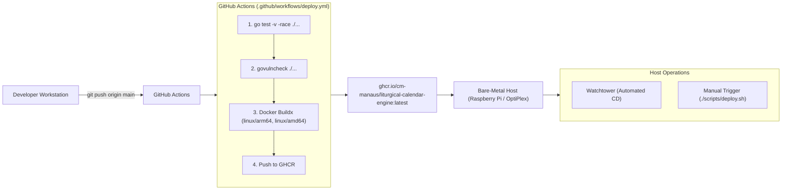

# Deployment, CI/CD, and Observability Guide

This document covers the Continuous Integration / Continuous Deployment (CI/CD) pipeline, GitHub Container Registry (GHCR) packaging, automated rollout, and rollback procedures for `liturgical-calendar-engine`.

---

## 1. CI/CD Architecture



---

## 2. Pre-Push Local Verification

Before pushing commits to `main`, execute the test suite locally with the race detector enabled:

```bash
go test -v -race ./...
```

To run performance microbenchmarks:

```bash
go test -bench=. -benchmem ./engine
```

---

## 3. Automated Deployment (Zero-Touch GitOps)

The primary deployment mechanism is automated through GitHub Actions and Watchtower:

1. Commit and push changes to `main`:
   ```bash
   git add .
   git commit -m "feat: description of change"
   git push origin main
   ```
2. **GitHub Actions** runs the test suite, performs static vulnerability analysis via `govulncheck`, compiles multi-architecture Docker binaries (`linux/arm64`, `linux/amd64`), and pushes the tagged image to `ghcr.io/cm-manaus/liturgical-calendar-engine:latest`.
3. **Watchtower** running on the host polls the registry every 5 minutes, pulls updated digest layers, gracefully restarts the container, and removes dangling images.

---

## 4. Manual Deployment Trigger

If immediate rollout is required without waiting for the Watchtower polling interval:

```bash
# Uses PI_HOST env var or defaults to raspberrypi.local
./scripts/deploy.sh
```

The script:
1. Connects to the host node over SSH.
2. Executes `docker compose pull liturgical-backend` to fetch the latest digest.
3. Restarts the service with zero unnecessary downtime (`docker compose up -d liturgical-backend`).
4. Prunes obsolete image layers (`docker image prune -f`).
5. Executes an end-to-end smoke test against the live production endpoint.

---

## 5. Host Metrics and Container Inspection

To inspect runtime metrics directly on the host without high-overhead web dashboards:

### Live Resource Consumption (CPU & RAM)
```bash
ssh <USER>@<NODE_IP> "docker stats --no-stream"
```

### Container Status
```bash
ssh <USER>@<NODE_IP> "docker ps --filter name=liturgical-backend"
```

### Service Logs
```bash
ssh <USER>@<NODE_IP> "cd ~/liturgical-calendar-engine && docker compose logs -f --tail=100 liturgical-backend"
```

---

## 6. Emergency Rollback Procedures

### Option A: Pinning a Previous Image Digest (Fastest)
On the target host, modify `docker-compose.yml` to specify a previous Git SHA tag (e.g. `sha-xxxxxxx`) and recreate the container:

```bash
ssh <USER>@<NODE_IP> "cd ~/liturgical-calendar-engine && docker compose up -d liturgical-backend"
```

### Option B: Git Revert (Full Pipeline Audit Trail)
Revert the faulty commit on your workstation and push to `main`:

```bash
git revert HEAD
git push origin main
```

The CI/CD pipeline will rebuild and redeploy the previous stable state automatically.

---

## 7. Post-Deployment Smoke Testing

Verify HTTP responses across the primary calendar endpoints:

```bash
# 1. Health check endpoint
curl -s -i "https://api.salvemaria.xyz/healthz"

# 2. 1962 Liturgical Day resolution
curl -s "https://api.salvemaria.xyz/api/v1/liturgical-day?date=2026-08-26&calendar=1962&lang=pt-br"

# 3. 1954 Pre-1955 Liturgical Day resolution
curl -s "https://api.salvemaria.xyz/api/v1/liturgical-day?date=2026-08-26&calendar=1954&lang=pt-br"

# 4. Prometheus metrics exposition
curl -s "https://api.salvemaria.xyz/metrics" | grep liturgical_requests_total
```
