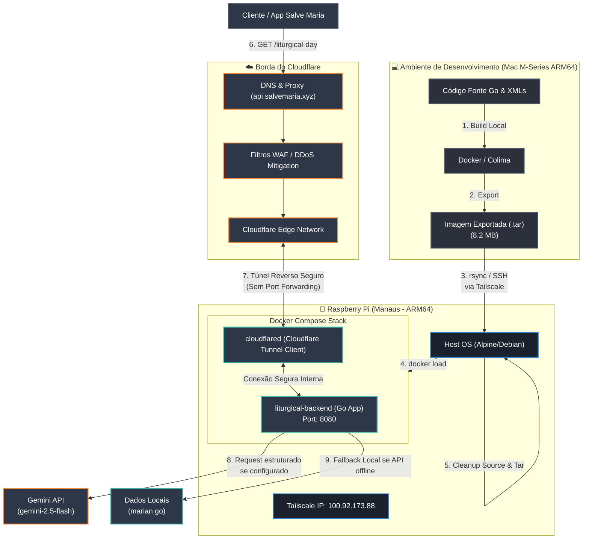

# ⚜️ tesouro-backend-go

Este repositório contém o **Motor Litúrgico** e a **API do Santo do Dia** (Congregação Mariana) que alimenta a plataforma **Salve Maria**. O projeto foi estruturado utilizando a linguagem Go para obter a máxima eficiência e segurança em ambientes de recursos limitados.

---

## 🗺️ Arquitetura do Sistema e Design de Infraestrutura

O diagrama abaixo ilustra o fluxo completo, desde o desenvolvimento e compilação no Mac (Apple Silicon), passando pela esteira de deploy simplificada, até a execução no Raspberry Pi em Manaus e a exposição pública via Cloudflare Tunnels:



---

## ⚡ Justificativa da Escolha de Tecnologias (System Design Rationale)

Esta seção documenta as decisões arquiteturais tomadas para o projeto, servindo como material de referência para entrevistas de engenharia de software (System Design).

### 1. Por que Go (Golang) em vez de Node.js/Python?
* **Binário Estático Único:** Go compila para um único binário executável que inclui todas as dependências. Não há necessidade de instalar um interpretador (como Python) ou um runtime pesado (como Node.js) no servidor host.
* **Baixíssimo Consumo de Recursos:** A API consome apenas **~15-25 MB de RAM** em produção e **~0% de CPU** quando ociosa. Isso é ideal para servidores de placa única (SBC) como o Raspberry Pi, onde RAM e escrita em disco (desgaste do cartão SD) são os principais gargalos.
* **Standard Library Poderosa:** O Go 1.22+ fornece um roteador HTTP muito robusto nativamente no pacote `net/http` (`ServeMux`). Eliminamos completamente dependências de terceiros para roteamento (como Gin, Fiber ou Echo), o que reduz drasticamente o tamanho final do binário e eventuais vulnerabilidades de segurança (superfície de ataque).

### 2. Por que Cloudflare Tunnels em vez de Port Forwarding + Dynamic DNS (DDNS)?
* **Segurança da Rede Doméstica:** Com o Cloudflare Tunnel (`cloudflared`), o Raspberry Pi abre conexões *outbound* (de dentro para fora) com a borda da Cloudflare. Não há portas abertas (como 80 ou 443) no seu roteador residencial de Manaus, bloqueando scanners de portas e ataques direcionados.
* **Transposição de CGNAT / IP Dinâmico:** ISPs residenciais frequentemente colocam clientes atrás de CGNAT ou mudam o IP público constantemente. O túnel resolve isso nativamente, pois a Cloudflare sempre sabe onde o cliente `cloudflared` está conectado, independentemente de mudanças de IP.
* **Segurança de Borda:** DDoS, ataques de injeção e bots maliciosos são mitigados diretamente nos servidores da Cloudflare, antes mesmo que os pacotes cheguem à sua conexão residencial em Manaus.

### 3. Por que compilar no Mac e enviar o `.tar` (Deploy via Rsync) em vez de CI/CD tradicional ou build no Pi?
* **Compatibilidade de Arquitetura (Nativa ARM64):** Tanto os chips Apple Silicon (M1/M2/M3) quanto o processador do Raspberry Pi são de arquitetura **ARM64**. A imagem gerada localmente roda de forma idêntica no Pi, dispensando ferramentas lentas de emulação multi-arquitetura (como `docker buildx` com QEMU).
* **Economia de Recursos do Pi:** Compilar imagens Docker exige uso intensivo de CPU e escrita em disco. Fazer o build no Mac poupa o hardware do Raspberry Pi de picos de processamento térmico e estresse do cartão de memória SD.
* **Velocidade de Iteração:** Fazer o build localmente leva menos de 5 segundos. O arquivo final empacotado tem apenas **~8.2 MB**, tornando a transferência por rede (mesmo em conexões residenciais) quase instantânea.

### 4. Por que a estratégia híbrida: Gemini 2.5 Flash + Fallback Local?
* **Uptime Garantido (Resiliência):** Se a cota da Gemini API estourar, o token expirar ou houver indisponibilidade na rede, a API responde imediatamente com dados locais pré-processados definidos em [`marian.go`](file:///Users/matheusdias/developer/tesouro-backend-go/engine/marian.go) e [`main.go`](file:///Users/matheusdias/developer/tesouro-backend-go/main.go#L402), resultando em **100% de disponibilidade** para o cliente final.
* **Tipagem Rígida e Validação de Dados:** Usamos o recurso de **Structured Outputs (JSON Schema)** da API Gemini para instruir o modelo a responder estritamente dentro da estrutura Go especificada na struct [`GeminiTextResponse`](file:///Users/matheusdias/developer/tesouro-backend-go/main.go#L477). Isso evita erros de parsing em produção por respostas textuais inesperadas do LLM.

---

## 🔒 Hardening e Segurança de Contêineres

Para rodar em ambiente de produção com segurança, o contêiner do backend no [`docker-compose.yml`](file:///Users/matheusdias/developer/tesouro-backend-go/docker-compose.yml) aplica as seguintes regras de segurança da kernel Linux:

1. **`read_only: true`:** O contêiner não pode alterar nenhum arquivo dentro de sua imagem compilada. Se a aplicação for invadida por meio de alguma vulnerabilidade, o atacante não conseguirá injetar scripts ou alterar os binários.
2. **`tmpfs: - /tmp`:** Como o sistema é somente leitura, criamos um diretório temporário montado diretamente na RAM para operações temporárias necessárias do Go.
3. **`cap_drop: - ALL`:** Remove todas as capacidades (capabilities) especiais da kernel Linux do processo. O contêiner não pode manipular interfaces de rede, carregar módulos da kernel ou alterar propriedades do sistema host.
4. **`security_opt: - no-new-privileges:true`:** Previne que processos filhos do contêiner ganhem mais privilégios que o processo pai (evitando ataques de elevação de privilégios como SUID executáveis).

---

## 📦 Estrutura de Arquivos do Projeto

```bash
├── main.go            # Ponto de entrada, rotas HTTP e integração estruturada com a Gemini API
├── Dockerfile         # Dockerfile multi-stage otimizado (Alpine Base de ~8.2MB)
├── docker-compose.yml # Definição dos serviços do backend e do agente cloudflared
├── DEPLOY.md          # Guia e comando de linha única para build local e deploy no Pi
├── data/              # Base de dados em XML dos ciclos litúrgicos e traduções
└── engine/            # Motor de cálculo litúrgico e modelos tipados
    ├── easter.go      # Algoritmo de computação da data da Páscoa
    ├── engine.go      # Lógica de processamento de dias e precedências litúrgicas
    ├── marian.go      # Lista estática de Santos e Beatos marianos
    ├── models.go      # Structs de domínio litúrgico
    └── ...
```

---

## 🚀 Como fazer o Deploy

Para rodar a esteira de deploy compilando no Mac e executando no Raspberry Pi de Manaus, utilize o comando unificado documentado no [`DEPLOY.md`](file:///Users/matheusdias/developer/tesouro-backend-go/DEPLOY.md#L49-L55):

```bash
docker-compose up --build -d && \
docker save -o tesouro-backend-go-liturgical-backend.tar tesouro-backend-go-liturgical-backend:latest && \
rsync -avz --exclude .git --exclude .venv --exclude .DS_Store --exclude .env ./ matheus@100.92.173.88:/home/matheus/tesouro-backend-go/ && \
ssh matheus@100.92.173.88 "cd /home/matheus/tesouro-backend-go && sudo docker load -i tesouro-backend-go-liturgical-backend.tar && sudo docker compose down --remove-orphans && sudo docker compose up -d && rm -rf engine/ data/ main.go Dockerfile go.mod tesouro-backend-go-liturgical-backend.tar"
```

*Para mais detalhes sobre solução de problemas ou configurações de variáveis de ambiente do Cloudflare Tunnel, consulte o [`DEPLOY.md`](file:///Users/matheusdias/developer/tesouro-backend-go/DEPLOY.md).*
