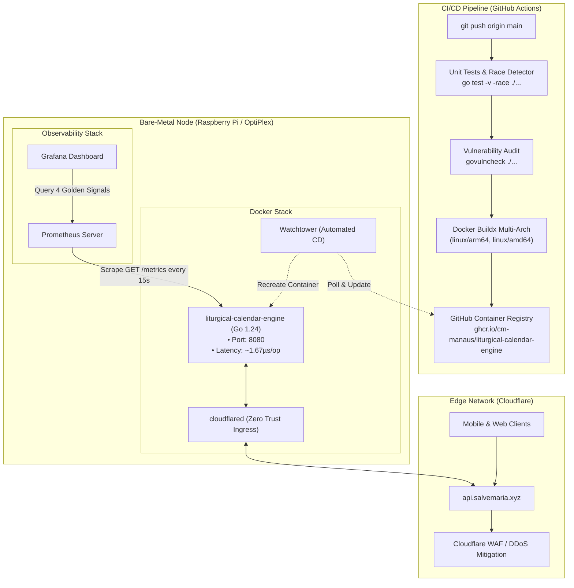

# liturgical-calendar-engine

[](https://github.com/cm-manaus/liturgical-calendar-engine/actions/workflows/deploy.yml)


A standalone computation engine and HTTP service written in Go for calculating the traditional Roman Rite liturgical calendar according to the 1962 (*Missale Romanum*) and 1954 (*Divino Afflatu / Pre-1955*) rubrics.

---

## Overview

Calculating liturgical dates in the Roman Rite involves non-trivial algorithmic complexity:
- Movable temporal cycles anchored on the astronomical Gregorian Easter computus.
- Multi-tier precedence tables governing feast occurrences (same day conflict) and concurrences (overlapping First/Second Vespers).
- Distinct historical rubrics across reforms (1962 four-class system vs. 1954 pre-1955 octave hierarchies).

This project implements the rubrical resolution engine entirely in memory with zero external database dependencies, providing deterministic sub-microsecond evaluation and integrated Prometheus observability.

---

## Architecture & System Design



---

## Key Technical Decisions

### 1. In-Memory Graph & Tables
Rubrics, temporal seasons, and santoral cycles are parsed from XML assets into strongly-typed Go data structures at engine initialization. Lookups execute against in-memory slices and pointers without disk I/O or network serialization overhead.

### 2. Zero Database Dependency
By avoiding external databases (SQL/NoSQL), the service achieves:
- **Zero SQL Injection Surface:** No SQL statements exist in the codebase.
- **Zero Connection Overhead:** No connection pools, socket timeouts, or database migrations.
- **Deterministic Latency:** Eliminates tail-latency spikes caused by database lock contention or disk I/O waits.

### 3. Native OpenMetrics / Prometheus Telemetry
The service exports a zero-dependency `/metrics` endpoint adhering to the OpenMetrics standard. It tracks:
- Request counts partitioned by HTTP status class (`2xx`, `4xx`, `5xx`), method, and route.
- In-flight active requests and request duration histograms.
- Go runtime internals: active goroutines, heap allocation, GC cycles, and system memory.

### 4. Container Security & Hardening
The production container runs with kernel-level isolation flags defined in `docker-compose.yml`:
- `read_only: true`: Read-only root filesystem prevents binary or asset tampering.
- `tmpfs: /tmp`: Volatile scratch space stored exclusively in RAM.
- `cap_drop: ALL`: Drops all Linux kernel capabilities.
- `security_opt: [no-new-privileges:true]`: Disallows child processes from escalating privileges.

---

## Rubrical Coverage

### 1962 Roman Missal (John XXIII)
- Four-class ranking system (`I`, `II`, `III`, `IV`).
- Precedence rules for feast transfers (e.g., Annunciation transfer per §96a when falling in Holy Week or Easter Octave).
- Commemoration suppression rules (§108) and Saturday Marian Masses (§78).
- Liturgical metadata resolution: Gloria, Credo, Preface, Epistle, and Gospel.

### 1954 Pre-1955 (Divino Afflatu)
- Six-rank system (*Duplex I Classis*, *Duplex II Classis*, *Duplex Maius*, *Duplex*, *Semiduplex*, *Simplex*) and three feria ranks (*Privilegiata*, *Major*, *Minor*).
- Pre-1955 octave hierarchies (Privileged 1st, 2nd, 3rd Order, Common, and Simple).
- Dynamic post-Pentecost Sunday redistribution with Epiphany Sunday reallocation.
- Full concurrence resolution for First and Second Vespers.
- Integrated Diocesan Propers of Brazil.

---

## Benchmarks

Microbenchmarks measured on Apple Silicon (Go 1.24, `darwin/arm64`):

```text
pkg: github.com/cm-manaus/liturgical-calendar-engine/engine
BenchmarkEasterCalculation-10    98778002        12.11 ns/op         0 B/op        0 allocs/op
Benchmark1962Resolution-10        728830         1671 ns/op       856 B/op       12 allocs/op
```

- **Easter Computus:** Resolves in **12.11 nanoseconds** with **zero memory allocations**.
- **1962 Liturgical Day Resolution:** Complete day resolution, color derivation, and precedence evaluation in **1.67 microseconds**.

---

## API Reference

### 1. Get Liturgical Day
Retrieves liturgical details (rank, liturgical color, feast name, commemorations) for a specific date:

```bash
curl -s "https://api.salvemaria.xyz/api/v1/liturgical-day?date=2026-08-26&calendar=1962&lang=pt-br"
```

### 2. Get Liturgical Month
Retrieves the complete liturgical calendar for an entire month:

```bash
curl -s "https://api.salvemaria.xyz/api/v1/liturgical-month?year=2026&month=8&calendar=1962&lang=pt-br"
```

### 3. Prometheus Metrics
Exposes real-time system and HTTP metrics:

```bash
curl -s "https://api.salvemaria.xyz/metrics"
```

### 4. Interactive OpenAPI Documentation
Interactive Scalar documentation is served directly at:
```text
https://api.salvemaria.xyz/docs
```

---

## Local Development

### Prerequisites
- Go 1.24+
- Docker & Docker Compose (optional, for containerized execution)

### Running Tests
```bash
# Execute unit test suite with Go race detector
go test -v -race ./...

# Run microbenchmarks with memory allocation profiling
go test -bench=. -benchmem ./engine
```

### Running Locally
```bash
# Run standalone HTTP service on port 8080
go run main.go
```

---

## License

This project is licensed under the MIT License. See [LICENSE](LICENSE) for details.
