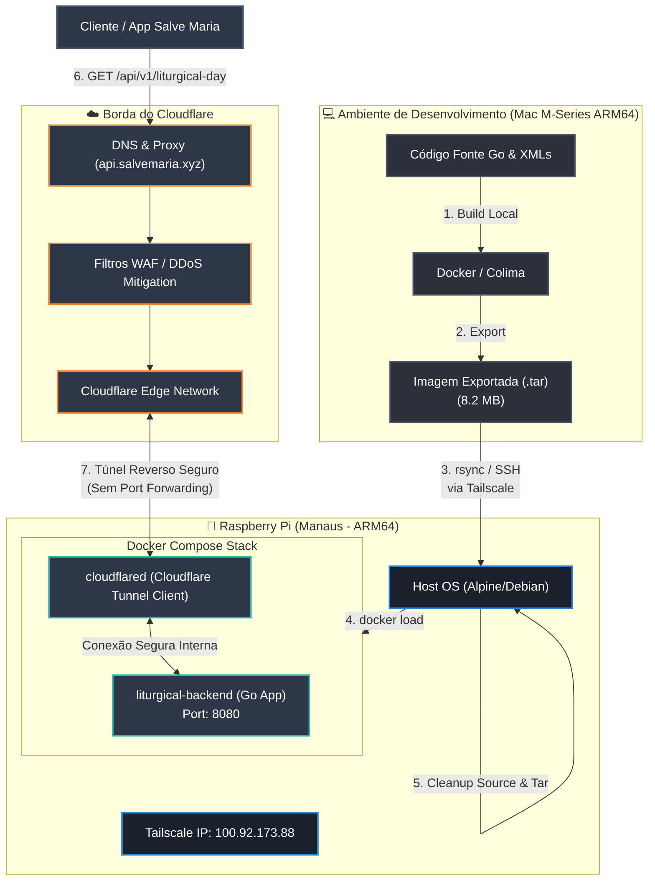

# ⚜️ tesouro-backend-go

Este repositório contém o **Motor Litúrgico Tradicional (1962 e 1954 Pré-55)** em Go que alimenta a plataforma **Salve Maria**. O projeto foi estruturado para obter máxima performance, baixíssimo consumo de recursos e segurança em contêineres Docker no Raspberry Pi.

---

## 🗺️ Arquitetura do Sistema e Design de Infraestrutura

O diagrama abaixo ilustra o fluxo completo, desde o desenvolvimento e compilação no Mac (Apple Silicon), passando pela esteira de deploy simplificada, até a execução no Raspberry Pi em Manaus e a exposição pública via Cloudflare Tunnels:



---

## ⚡ Suporte a Calendários Litúrgicos

1. **1962 (Missale Romanum de João XXIII):**
   - Sistema de 4 Classes (`I`, `II`, `III`, `IV`).
   - Transferência da Anunciação (§96a) quando incidente na Semana Santa ou Oitava Pascal.
   - Regras de supressão de comemorações penitenciais (§108).
   - Missa de Nossa Senhora aos Sábados (§78).
   - Metadados litúrgicos: Glória, Credo, Prefácio, Epístola e Evangelho.

2. **1954 (Divino Afflatu / Pré-55):**
   - Sistema de 6 Graus de Festas (*Duplex I Classis, Duplex II Classis, Duplex Maius, Duplex, Semiduplex, Simplex*) e 3 Graus de Férias (*Privilegiata, Major, Minor*).
   - Oitavas pré-55 (Privilegiada de 1ª, 2ª, 3ª Ordem, Comum e Simples).
   - Regras completas de concorrência (Primeiras Vésperas), ocorrência e comemorações múltiplas.
   - Distribuição dinâmica de Domingos após Pentecostes com realocação dos domingos omitidos da Epifania.
   - Regras de transferências de festas da Semana Santa e Oitava Pascal.
   - Próprio do Brasil sobreposto de forma harmonizada.

---

## 🔒 Hardening e Segurança de Contêineres

Para rodar em ambiente de produção com segurança, o contêiner do backend no `docker-compose.yml` aplica as seguintes regras de segurança da kernel Linux:

1. **`read_only: true`:** O contêiner não pode alterar nenhum arquivo dentro de sua imagem compilada.
2. **`tmpfs: - /tmp`:** Diretório temporário montado diretamente na RAM para operações temporárias necessárias do Go.
3. **`cap_drop: - ALL`:** Remove todas as capacidades especiais da kernel Linux do processo.
4. **`security_opt: - no-new-privileges:true`:** Previne que processos filhos ganhem mais privilégios que o processo pai.

---

## 📦 Estrutura de Arquivos do Projeto

```bash
├── main.go               # Ponto de entrada e rotas HTTP (ServeMux)
├── main_test.go          # Testes de integração das rotas HTTP
├── Dockerfile            # Dockerfile multi-stage minimalista (Alpine ~8.2MB)
├── docker-compose.yml    # Definição dos serviços do backend e do túnel cloudflared
├── DEPLOY.md             # Guia de deploy e procedimento de rollback de emergência
├── api_requests_prod.md  # Exemplos curl de todos os endpoints
├── data/                 # Bases de dados XML e arquivos de tradução
│   ├── 1954/             # Temporal e Sanctoral do calendário de 1954 (Divino Afflatu)
│   ├── temporal.xml      # Ciclo temporal de 1962 com leituras
│   ├── sanctoral.xml     # Santoral universal de 1962 com leituras
│   ├── brazilian_sanctoral.xml # Santoral do Brasil com leituras e festas próprias
│   └── values-*/         # Dicionários de tradução (pt, pt-BR, en, es, fr, de, la)
└── engine/               # Motor de cálculo litúrgico
    ├── easter.go         # Algoritmo de computação da data da Páscoa
    ├── engine.go         # Orquestrador dual de calendários (1962 e 1954)
    ├── engine_test.go    # Testes unitários do motor litúrgico
    ├── localization.go   # Gerenciador de traduções Android XML
    ├── models.go         # Modelos de domínio e serialização JSON
    ├── pre55_rank.go     # Enums e regras de precedência pré-55
    ├── profile_1954.go   # Motor do calendário de 1954
    ├── sanctorale.go     # Santoral de 1962 e Próprio do Brasil
    └── temporal.go       # Temporal de 1962
```

---

## 📡 Guia de Requisições cURL da API

A API está disponível publicamente em **`https://api.salvemaria.xyz`** (ou `http://localhost:8080` em desenvolvimento local).

### 1. Status & Metadados
```bash
curl -s -X GET "https://api.salvemaria.xyz/"
```

### 2. Dia Litúrgico (1962 - Tridentino)
```bash
# Dia atual em português
curl -s -X GET "https://api.salvemaria.xyz/api/v1/liturgical-day?lang=pt-br"

# Data específica (com leituras da Missa)
curl -s -X GET "https://api.salvemaria.xyz/api/v1/liturgical-day?date=2026-10-12&calendar=1962&lang=pt-br"

# Via POST com JSON
curl -s -X POST "https://api.salvemaria.xyz/api/v1/liturgical-day" \
  -H "Content-Type: application/json" \
  -d '{"date": "2026-12-25", "calendar": "1962", "lang": "pt-br"}'
```

### 3. Dia Litúrgico (1954 - Divino Afflatu / Pré-55)
```bash
# Dia atual pré-55 com graus clássicos (Duplex, Semiduplex, Simplex)
curl -s -X GET "https://api.salvemaria.xyz/api/v1/liturgical-day?calendar=1954&lang=pt-br"

# Festa com Oitava e Leituras
curl -s -X GET "https://api.salvemaria.xyz/api/v1/liturgical-day?date=2026-01-06&calendar=1954&lang=pt-br"
```

### 4. Mês Completo
```bash
# Mês atual (1962)
curl -s -X GET "https://api.salvemaria.xyz/api/v1/liturgical-month?lang=pt-br"

# Mês específico em 1954 (Agosto de 2026)
curl -s -X GET "https://api.salvemaria.xyz/api/v1/liturgical-month?year=2026&month=8&calendar=1954&lang=pt-br"
```

*Para a lista completa de parâmetros e exemplos de respostas JSON, consulte o [`api_requests_prod.md`](api_requests_prod.md).*

---

## 🚀 Como fazer o Deploy e Testar

```bash
# Rodar testes localmente
go test -v ./...

# Linha única de deploy no Raspberry Pi
go test ./... && \
docker compose build && \
docker save -o tesouro-backend-go-liturgical-backend.tar tesouro-backend-go-liturgical-backend:latest && \
rsync -avz --exclude .git --exclude .venv --exclude .DS_Store --exclude .env ./ matheus@100.92.173.88:/home/matheus/tesouro-backend-go/ && \
ssh matheus@100.92.173.88 "cd /home/matheus/tesouro-backend-go && sudo docker load -i tesouro-backend-go-liturgical-backend.tar && sudo docker compose down --remove-orphans && sudo docker compose up -d && rm -rf engine/ data/ main.go Dockerfile go.mod tesouro-backend-go-liturgical-backend.tar"
```

*Para instruções completas de rollback de emergência, consulte o [`DEPLOY.md`](DEPLOY.md).*

